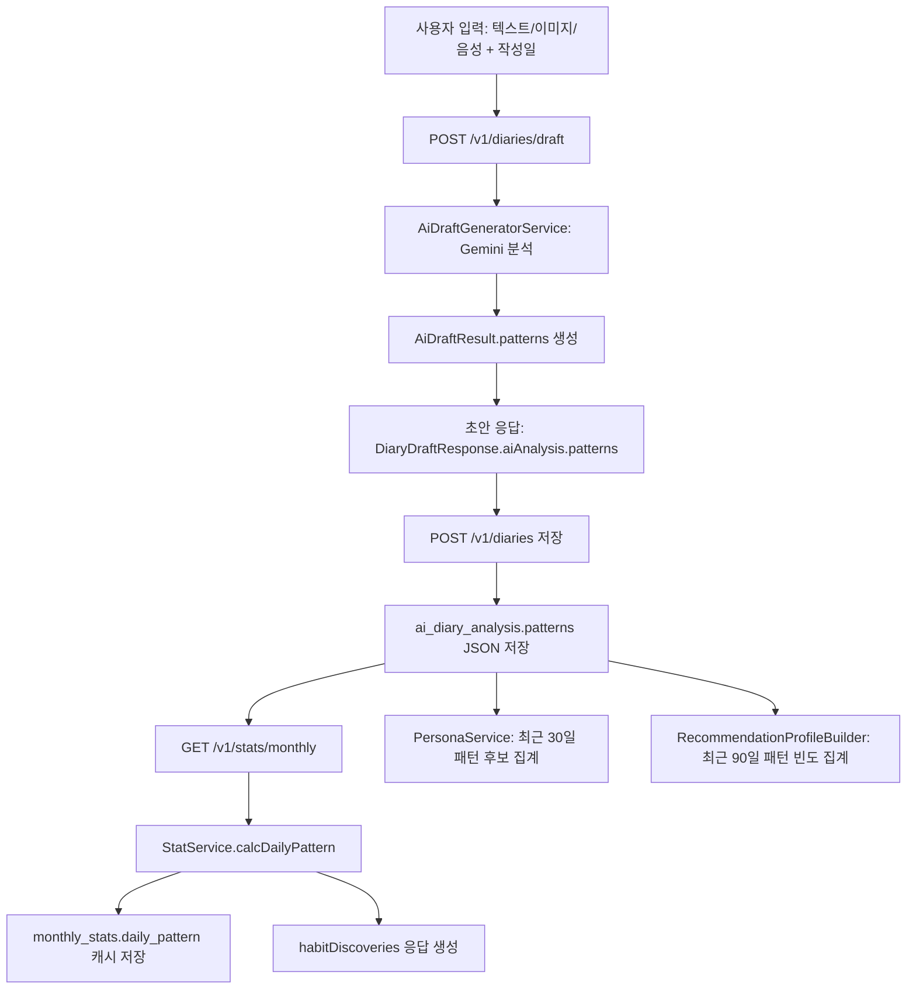

# 일상 패턴 처리 흐름

이 문서는 현재 백엔드에서 `일상 패턴` 데이터가 어떻게 생성, 저장, 집계, 활용되는지 정리한다.

## 한 줄 요약

일상 패턴은 사용자가 일기를 작성할 때 AI 분석 결과의 `patterns` JSON으로 생성되고, `ai_diary_analysis.patterns`에 저장된다. 이후 월별 통계에서는 `monthly_stats.daily_pattern`으로 빈도 집계된다. 프론트에는 원시 집계인 `dailyPattern`과 별도로, 사용자가 자신도 몰랐던 습관처럼 볼 수 있는 `habitDiscoveries` 표시용 목록을 함께 내려준다.

## 전체 흐름



## 1. 패턴 생성

패턴 생성은 일기 초안 생성 시점에 시작된다.

- API: `POST /v1/diaries/draft`
- 컨트롤러: `DiaryController.createDraft`
- 서비스: `DiaryService.createDraft`
- AI 호출: `AiDraftGeneratorService.generate`
- 프롬프트: `src/main/resources/prompts/diary-system.txt`

프롬프트는 AI가 아래 `patterns` 구조를 반환하도록 강제한다.

```json
{
  "time_of_day": "오후",
  "energy_level": 6,
  "social": "소수",
  "spending": true,
  "spending_category": "카페",
  "weather": "없음",
  "health": "보통",
  "sleep": "언급없음",
  "wake_time": null,
  "sleep_time": null,
  "meal_pattern": null,
  "caffeine_pattern": "오후 카페에서 커피",
  "weekday_pattern": null,
  "personal_pattern_candidates": [
    "오후에 카페에서 커피를 마시는 신호"
  ]
}
```

현재 의미상 핵심 패턴은 다음과 같다.

| 필드 | 의미 |
| --- | --- |
| `time_of_day` | 일기 내용의 주요 시간대 |
| `energy_level` | 에너지 수준, 1~10 |
| `social` | 혼자/소수/단체 |
| `spending` | 소비 발생 여부 |
| `spending_category` | 소비 카테고리 |
| `weather` | 날씨 |
| `health` | 컨디션 |
| `sleep` | 수면 상태 |
| `wake_time` | 기상 시간 후보 |
| `sleep_time` | 취침/수면 시간 후보 |
| `meal_pattern` | 식사 관련 반복 후보 |
| `caffeine_pattern` | 커피/차/에너지드링크 관련 반복 후보 |
| `weekday_pattern` | 요일과 연결되는 행동 후보 |
| `personal_pattern_candidates` | 사용자가 인식하지 못할 수 있는 반복 습관 후보 배열 |

DTO에서는 `AiDraftResult.Patterns`가 이 구조를 받는다. `@JsonAlias`가 붙어 있어 AI가 `snake_case` 또는 `camelCase`로 응답해도 일부 필드는 파싱된다.

## 2. 초안 응답

초안 생성 API는 DB에 일기를 저장하지 않는다. 대신 `DiaryDraftResponse`로 아래 데이터를 반환한다.

- `generatedText`: AI가 정리한 일기 본문
- `aiAnalysis.patterns`: 일상 패턴 분석 결과
- `mediaUrls`: 업로드된 이미지 URL

즉, 초안 단계의 패턴은 클라이언트가 확인하고 최종 저장 요청에 다시 넘겨야 유지된다.

## 3. 일기 저장과 패턴 저장

일기 저장 API는 `POST /v1/diaries`이다.

저장 시 `aiAnalysis`가 포함되어 있으면 그 값을 그대로 저장한다.

```java
.patterns(objectMapper.writeValueAsString(analysis.patterns()))
```

저장 위치는 `AiEmotionAnalysisVO`의 `patterns` 필드다.

- 테이블: `ai_diary_analysis`
- 컬럼: `patterns`
- 타입: JSON

만약 저장 요청에 `aiAnalysis`가 없으면 `DiaryService.saveDiary`가 다시 `generateAnalysis`를 호출해서 현재 입력값 기준으로 AI 분석을 생성한 뒤 저장한다.

## 4. 월별 통계 집계

월별 통계 API는 `GET /v1/stats/monthly?year=YYYY&month=M`이다.

`StatService.getOrCalculate`는 먼저 `monthly_stats` 캐시를 조회한다. 캐시가 없으면 해당 월의 일기와 분석 데이터를 읽어 즉시 집계한다.

일상 패턴 집계는 `StatService.calcDailyPattern`에서 수행된다.

동작 방식은 단순 빈도 누적이다.

1. 해당 월의 `ai_diary_analysis.patterns` JSON을 읽는다.
2. 각 key/value를 순회한다.
3. 값이 배열이면 각 원소를 별도 후보로 누적한다.
4. 값이 단일 값이면 문자열로 변환해서 누적한다.
5. `null`과 빈 문자열은 제외한다.
6. 각 패턴 항목 내부를 빈도 내림차순으로 정렬한다.

예상 결과 형태:

```json
{
  "time_of_day": {
    "오후": 8,
    "저녁": 3
  },
  "caffeine_pattern": {
    "오후 카페에서 커피": 4,
    "점심쯤 커피": 2
  },
  "personal_pattern_candidates": {
    "오후에 카페에서 커피를 마시는 신호": 4
  }
}
```

집계 결과는 `monthly_stats.daily_pattern`에 JSON으로 캐시된다.

프론트가 "사용자가 모르는 습관 발견" UI를 만들 때는 원시 집계인 `dailyPattern`보다 `habitDiscoveries`를 우선 사용한다.

```json
{
  "habitDiscoveries": [
    {
      "category": "개인 습관",
      "patternKey": "personalPatternCandidates",
      "pattern": "오후에 카페에서 커피를 마시는 신호",
      "count": 4,
      "message": "오후에 카페에서 커피를 마시는 신호 패턴이 이번 달 4번 나타났어요."
    },
    {
      "category": "카페인 습관",
      "patternKey": "caffeinePattern",
      "pattern": "오후 카페에서 커피",
      "count": 3,
      "message": "오후 카페에서 커피 패턴이 이번 달 3번 나타났어요."
    }
  ]
}
```

`habitDiscoveries`는 아래 패턴만 추려 만든다.

- `personalPatternCandidates`
- `weekdayPattern`
- `mealPattern`
- `caffeinePattern`
- `wakeTime`
- `sleepTime`

구버전 데이터 호환을 위해 `snake_case` 키도 함께 인식한다.

## 5. 캐시 무효화

일기 데이터가 바뀌면 해당 월의 통계 캐시를 삭제한다.

`DiaryService.invalidateMonthlyStat`가 아래 작업에서 호출된다.

- 일기 저장
- 일기 수정
- 일기 삭제
- 이미지 추가
- 이미지 교체
- 이미지 삭제

따라서 다음 월별 통계 조회 시 최신 일기/분석 데이터를 기준으로 다시 계산된다.

단, 현재 일기 수정은 `rawContent`와 `emoji`만 수정하고 AI 분석을 재생성하지 않는다. 그래서 본문만 수정한 경우 기존 `ai_diary_analysis.patterns`는 자동으로 바뀌지 않는다.

## 6. 페르소나에서의 활용

페르소나는 `PersonaService`에서 최근 30일 분석 데이터를 사용한다.

생성 조건:

- 최근 30일 일기 5개 이상
- 마지막 생성 후 7일 경과
- 마지막 생성 이후 새 일기 존재

패턴 활용 방식:

- `personal_pattern_candidates`
- `wake_time`
- `sleep_time`
- `meal_pattern`
- `caffeine_pattern`
- `weekday_pattern`

위 항목만 별도로 뽑아 빈도를 누적한다. 이후 상위 8개를 `개인 일상 패턴 후보`로 페르소나 프롬프트에 전달한다.

`time_of_day`, `energy_level`, `social`, `spending` 같은 일반 패턴은 현재 페르소나 후보 집계에는 포함되지 않는다.

## 7. 추천에서의 활용

추천 프로필은 `RecommendationProfileBuilder`가 만든다.

기준 기간:

- 기본: 최근 90일
- 최근 90일 분석 데이터가 없으면 전체 분석 데이터 사용

추천 쪽은 `patterns` JSON의 모든 key/value를 빈도로 누적한다. 배열 값은 각 원소를 별도 값으로 누적한다.

이후 `RecommendationProfile.toPromptSummary`에서 아래처럼 추천 프롬프트에 포함된다.

```text
일상 패턴: time_of_day=오후(8), 저녁(3) / caffeine_pattern=오후 카페에서 커피(4)
```

추천 프롬프트는 개인 일상 패턴이 있으면 일반 IAB 취향 태그보다 우선해서 추천 이유에 반영하도록 작성되어 있다.

## 현재 주의점

- 패턴은 AI가 생성한 후보 데이터이며, 단일 일기만으로 확정된 습관으로 보지 않는다.
- `personal_pattern_candidates`는 프롬프트상 "후보/신호" 수준으로 생성된다.
- 저장 후 본문 수정 시 AI 분석과 패턴은 자동 재분석되지 않는다.
- 월별 통계는 캐시 기반이다. 일기 변경 시 캐시는 삭제되지만, 분석 JSON 자체가 그대로면 재집계 결과도 그대로다.
- `StatService`와 `RecommendationProfileBuilder`는 모든 패턴 필드를 누적하지만, `PersonaService`는 개인 습관 후보와 시간/식사/카페인/요일 계열만 사용한다.
- 프론트에서 습관 발견 UI를 만들 때는 `GET /v1/stats/monthly` 응답의 `habitDiscoveries`를 사용한다. `dailyPattern`은 상세 통계나 디버깅용 원시 집계로 보면 된다.
